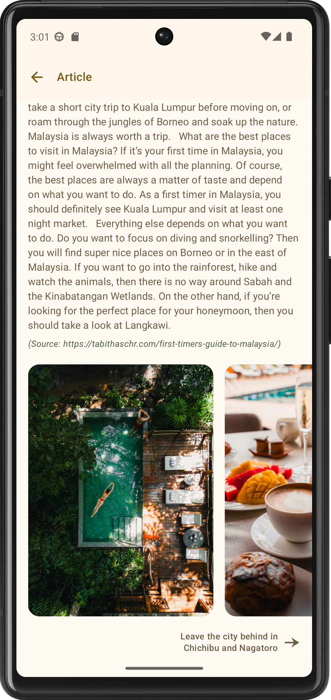

# Let's Travel: Your Ultimate Travel Planner

    

Let's Travel is your all-in-one travel companion, designed to make planning and organizing trips effortless and enjoyable. Whether you're exploring a new city, planning a getaway with friends, or embarking on an epic solo adventure, Let's Travel ensures you stay organized and stress-free from start to finish.

Features demonstration (Youtube video):

## ✈️ Key Features

### 🗺️ Trip Planning Made Easy

**Save Flight Information:** Keep track of flight details, including dates, times, and confirmation numbers, all in one place.

**Hotel Organizer:** Store hotel bookings, check-in/check-out dates, and contact details for easy reference.

**Tourism Activities:** Plan your itinerary by saving details for attractions, tours, and activities.

    
    
    

### 💸 Smart Budget Tools

**Bill Splitting:** Split expenses with friends and calculate individual contributions. No more awkward math or arguments!

**Price Statistics:** View detailed statistics and breakdowns of your expenses by category, such as flights, accommodation, food, and activities, to better manage your travel budget.

    
    

### 📸 Preserve Your Memories

**Photo Storage:** Save your favorite travel moments directly in the app, organized by trip for easy browsing later.

 

### 🌟 Discover New Destinations

**Travel Inspiration:** Explore curated blog posts and articles about the latest travel destinations, hidden gems, and exciting tourism spots.

    
    
    

## 🧩 Tech Stack

### Architecture

- **Modularization:**

    + Divided into feature-specific modules (e.g., manage_trip, discover, photo_view, account) and core modules (e.g., app_navigation, core, ui_components).

- **Clean Architecture:** implements a 3-layer structure with clear responsibilities

    + Data Layer: Handles data sources (Room for local database and Firebase for remote source) and repository implementation.

    + Domain Layer: Contains business logic (use cases).

    + Presentation Layer: Uses MVVM architecture to manage UI and user interactions.

### Jetpack Compose for UI

- Entire UI is built using **Jetpack Compose**, with components like:
    + List, Grid, ViewPager, Charts (Custom Canvas), Carousel, Dialogs, and more.

- App navigation is powered by the latest **Jetpack Navigation** library (integrated with Compose).

### Local Data Source

- **Room Database:** Used for efficient local data storage and retrieval.

### Dependency Injection
- **Hilt:** Simplifies dependency injection for better modularity and testability.

### Firebase Integration

- **Firebase Firestore:** Stores blog posts and articles for the *discovery* feature.
- **Firebase Storage:** Manages photos for tourism articles and blog posts.

### Asynchronous Programming

- Kotlin **Coroutines/Flow:** Handles asynchronous tasks such as API calls and background operations with efficiency and simplicity.

### Image Loading

- **Coil:** Used for fast and lightweight asynchronous photo loading in the app.

### Testing

Unit Test Coverage for following components:
- DAO objects (Data layer)
- Repositories (Data Layer)
- Use Cases (Domain Layer)
- ViewModels (Presentation Layer)
